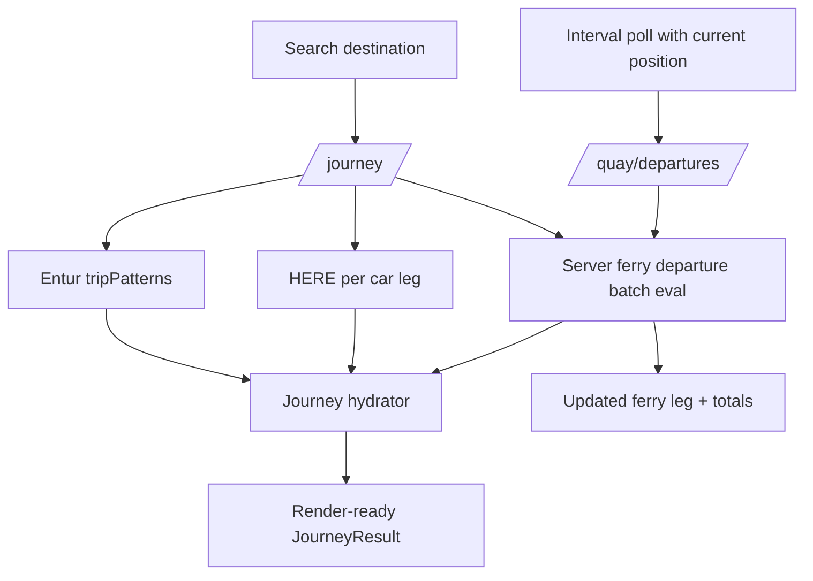

# Destination-Centric Backend-First Plan

## Goals

- Move ferry timing/margin/wait/via calculations from client to API.
- Keep user workflow/layout unchanged (search destination -> journey -> live updates).
- Replace existing contracts in place (`/journey`, `/quay/departures`) while minimizing duplicated logic across web/mobile.

## Current Survey Findings (API + Web)

- `/journey` currently composes Entur trip patterns + HERE enrichment in [packages/api/app.py](packages/api/app.py), [packages/api/journey_planner.py](packages/api/journey_planner.py), [packages/api/here_routing.py](packages/api/here_routing.py).
- `/quay/departures` currently computes leg-specific margins in [packages/api/journey_planner.py](packages/api/journey_planner.py), but web still performs hydration/refresh orchestration in [packages/web/components/Journey.tsx](packages/web/components/Journey.tsx) and [shared/services/tripStateMachine.ts](shared/services/tripStateMachine.ts).
- Client-side complexity hotspots are in [shared/services/journey.ts](shared/services/journey.ts) and [shared/services/tripStateMachine.ts](shared/services/tripStateMachine.ts): per-leg fetch loops, ETA estimation, interval/race guards.
- Shared types/UI still reflect partial hydration assumptions in [shared/types/index.ts](shared/types/index.ts), [packages/web/components/JourneyDetails.tsx](packages/web/components/JourneyDetails.tsx), [packages/web/components/JourneyMap.tsx](packages/web/components/JourneyMap.tsx).

### Current Contract Snapshot (Mapped)

- `GET /journey?from=<lat,lng>&to=<lat,lng>`
  - Current request params: `from`, `to` (required, comma-separated lat/lng).
  - Current response: `JourneyResult[]` with legs (`car`/`water`), optional HERE geometry on car legs, but without guaranteed server-selected ferry departure per ferry leg.
- `GET /quay/departures?quayId=<NSR>&toQuayId=<NSR>&arrivalTime=<ISO>`
  - Current request params: `quayId`, `toQuayId` (required), `arrivalTime` (optional but used for margin).
  - Current response: `DepartureOption[]` scoped to target `toQuayId`, with `marginMinutes`, `isFirstReachable`, and `journey` calls.

### Replacement Contract Direction (Active)

- `/journey` now returns destination-centric hydrated ferry metadata per ferry leg (`departures`, `selectedDeparture`, `waitSeconds`, `viaStopNames`) plus canonical journey totals (`travelDurationSeconds`, `waitDurationSeconds`, `totalDurationSeconds`).
- `/quay/departures` now supports `mode=refresh` to return a normalized leg refresh patch shape (`departures`, selected departure metadata, wait/margin fields) while legacy list behavior remains available for compatibility.

### Actual State vs. Plan (as of 2026-04-24)

The hydration pipeline is wired up server-side, but most of the destination-centric contract is silently discarded before reaching the client. Treat the section above as the *intended* contract; the list below is what actually ships.

**`/journey` — what the client currently receives:**
- Per ferry leg: `departures[]` ✓ (hydrated server-side).
- `selectedDeparture` — computed in `hydrate_destination_journey`, then stripped by `_prune_journey_for_client` (`allowed_leg_fields` excludes it). Client re-derives via `selectDeparturesForDisplay` in `shared/utils/index.ts`.
- `viaStopNames` — never computed; `evaluate_ferry_departures` does not extract via stops.
- `travelDurationSeconds`, `waitDurationSeconds`, `totalDurationSeconds`, `expectedStartTime` — computed and then stripped by `_prune_journey_for_client` (`allowed_journey_fields = {"expectedEndTime", "duration", "legs"}`). Only `duration` survives.
- `nextRefreshAt`, `nextFerryLegIndex` — not implemented.
- Reachability flags (`isFirstReachable`) — removed; not replaced.

**`/quay/departures?mode=refresh` — what ships:**
- Returns `patch["departures"]` only. No selected departure metadata, no recomputed totals, no leg-patch shape.
- Both refresh and legacy paths now require `toQuayId`; legacy callers that omitted it will 400.

**Server-side pipeline:**
- `hydrate_destination_journey` calls `evaluate_ferry_departures` sequentially per ferry leg — N+1 EnTur queries per journey. The target architecture diagram's `DepartureBatch` is not implemented.

**Web client:**
- `packages/web/components/Journey.tsx` still calls `refreshDepartures` from `shared/services/tripStateMachine.ts`, which still runs `estimateRemainingSeconds` (client-side ETA on `leg.geometry`) and constructs the arrival time before hitting the refresh endpoint. The ETA-heavy math the plan intended to remove is still on the client.
- `JourneyDetails.tsx` and `JourneyMap.tsx` still call `selectDeparturesForDisplay` to pick which departures to render — the server-selected departure is unavailable.
- `shared/types/index.ts` `JourneyResult`/`FerryLeg` still reflect the pre-rewrite contract (no canonical totals, no `selectedDeparture`, no via fields).

**Unblock order before resuming `simplify-web-client`:**
1. Expand `_prune_journey_for_client` allowlists to include the destination-centric fields (`selectedDeparture`, `travelDurationSeconds`, `waitDurationSeconds`, `totalDurationSeconds`, `expectedStartTime`).
2. Update `shared/types/index.ts` to match the new contract so the web client can consume it.
3. Make `/quay/departures?mode=refresh` return a real patch (selected departure + recomputed totals), not just the departures list.
4. Decide explicitly whether `viaStopNames` and batched ferry evaluation are in-scope for this rewrite or deferred — update this plan either way so design and implementation stay aligned.

## Target Architecture

## Contract Redesign (In-Place)

- `GET /journey`
  - Input unchanged: `from`, `to`.
  - Output becomes fully hydrated for destination-centric UI:
    - Each ferry leg includes: departures, selected departure, wait seconds, via stop(s), reachability metadata.
    - Journey includes canonical: `travelDurationSeconds`, `waitDurationSeconds`, `totalDurationSeconds` (and `duration` aligned to total).
    - Optional server hints for client rendering/polling (e.g. `nextRefreshAt`, `nextFerryLegIndex`).
- `GET /quay/departures`
  - Repurpose from single-leg helper to "refresh active journey ferry data" endpoint.
  - Accept narrow params for interval polling (current position + active leg context + quay IDs).
  - Return normalized leg patch + recomputed totals (not just raw departures).

## API Refactor Design

- Add a dedicated journey-domain service layer under `packages/api/`:
  - `journey_domain.py` (new): canonical hydration pipeline and timing math.
  - `departures_domain.py` (new): batch departure evaluation and via-stop extraction.
- Keep provider adapters isolated:
  - Entur adapter logic from [packages/api/journey_planner.py](packages/api/journey_planner.py).
  - HERE adapter logic from [packages/api/here_routing.py](packages/api/here_routing.py).
  - Nominatim adapter from [packages/api/nominatim.py](packages/api/nominatim.py).
- Normalize naming/model consistency:
  - Replace "quayId" ambiguity with explicit stop-place semantics internally.
  - Keep external param names only if needed for backward route naming.
- Centralize duration/wait recomputation in one function used by both endpoints.

## Web Client Simplification Plan

- Remove client hydration math from [packages/web/components/Journey.tsx](packages/web/components/Journey.tsx):
  - No per-ferry sequential departure fetching on initial load.
  - No client-side cumulative wait/duration recomputation.
- Simplify [shared/services/journey.ts](shared/services/journey.ts):
  - `fetchJourney` returns render-ready journey.
  - `fetchDeparturesForLeg` replaced by a refresh call returning server-computed patch.
- Simplify [shared/services/tripStateMachine.ts](shared/services/tripStateMachine.ts):
  - Keep local proximity-based state transitions.
  - Remove ETA-heavy departure math; polling just sends current context and applies server patch.
- Keep UI components mostly presentational:
  - [packages/web/components/JourneyDetails.tsx](packages/web/components/JourneyDetails.tsx) and [packages/web/components/JourneyMap.tsx](packages/web/components/JourneyMap.tsx) consume hydrated fields directly.

## External API Interaction Strategy

- Entur:
  - Continue as source of truth for ferry schedules and call chains.
  - Batch evaluate all ferry crossings for initial journey hydration.
- HERE:
  - Continue only for car-leg traffic/geometry.
  - Recompute totals after HERE duration replacement using canonical server helper.
- Nominatim:
  - No major contract changes; keep destination search semantics.

## Rollout & Safety

- Implement server-side unit tests around:
  - duration consistency (sum of legs + wait),
  - margin calculation,
  - via-stop extraction,
  - no-ferry and multi-ferry journeys.
- Add API integration fixtures for Entur response variants (`estimatedCalls` present/absent).
- Add web integration checks that one destination selection triggers:
  - one `/journey` call,
  - one scheduled refresh loop (`/quay/departures`) with no duplicate bursts.

## Open Risks To Watch During Implementation

- Entur edge cases where `estimatedCalls` is empty and fallback `passingTimes` lacks stop timing detail.
- Contract stability for existing consumers while replacing endpoint payloads in place.
- Payload growth when returning fully hydrated multi-ferry journeys.
